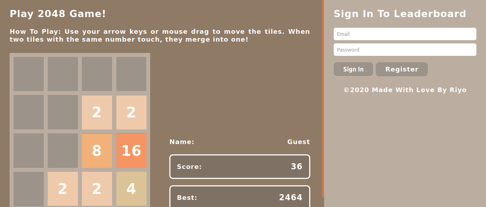

# 2048 Web Game

Built using HTML5, CSS3, SASS/SCSS, Javascript, PHP

## Introduction

The game's objective is to slide numbered tiles on a grid to combine them to create a tile with the number as much far as possilbe. We also have leaderboard which lists scores of all users in descending order.

## Setup

Fetch the repository and move folder in local directory of your server. Setup the database, and configuration of your api and that's it you are done.

More information over setting up config and database read README.md of api folder.

## Controls

Arrow Keys, W, S, A, D and Mouse Drag: Slide numbered tiles on a grid 

## Win

Game is endless, try to score as much as possible and reach at the top of leaderboard. 

## Game Over 

If you reach the point where entire grid is full and you won't be able slide any tile, it'll be game over.

## Developer Notes:

> **Note:**  We use strict coding standards, clean codes and well formed directory structures. Kindly follow same if you contribute to this project.